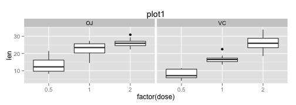
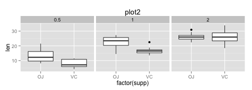

Basic inferential data analysis.
========================================================
### Analyze the ToothGrowth data in the R datasets package
### 1. Load the ToothGrowth data and perform some basic exploratory data analyses 

- initial understanding of the data.(using facets)
- make boxplots to campare Tooth length with different dosage for each supplements
 
- make boxplot to compare Tooth length with different supplement for each dosage
 
- from plot1 we can see the tooth length increase along with the increase of the dosage nomatter for which supplement.
- from plot2 it is a little hard to tell wheather there is difference impact on the tooth length between VC an OJ supplements for each dosage. (can make analysis on this point later)

### 2.Provide a basic summary of the data.
- Calculate the mean & sd for each dosage and supplement (use the ddply) 

```
## [1] 0.5 0.5 1   1   2   2  
## Levels: 0.5 1 2
```

```
##   dose supp  mean    sd
## 1  0.5   OJ 13.23 4.460
## 2  0.5   VC  7.98 2.747
## 3  1.0   OJ 22.70 3.911
## 4  1.0   VC 16.77 2.515
## 5  2.0   OJ 26.06 2.655
## 6  2.0   VC 26.14 4.798
```

### 3.Use confidence intervals and hypothesis tests to compare tooth growth by supp and dose. 
- We have two type of supp: orange juice and vitamin C. We need to use hypothesis testing to make conclusion if both supp have the same impact on tooth length.
- use paired t-test to comapre mean for two supp for each dose
- the confidence interval is for the difference between the length of toothlength under the effect of OJ and VC for each dose.

```r
ToothGrowth <- transform(ToothGrowth, dose=as.factor(dose))
s <- split(ToothGrowth, list(ToothGrowth$supp, ToothGrowth$dose))
t1 <- t.test(s[[1]][[1]], s[[2]][[1]], paired = TRUE, alternative = "greater")#dose= 0.5
t2 <- t.test(s[[3]][[1]], s[[4]][[1]], paired = TRUE, alternative = "greater")#dose = 1
t3 <- t.test(s[[5]][[1]], s[[6]][[1]], paired = TRUE, alternative = "greater")#dose = 2
```
- the confidence level for dose 0.5 is 2.0196, &infin;, and the p-value is 0.0077
- the confidence level for dose 0.5 is 2.7064, &infin;, and the p-value is 0.0041
- the confidence level for dose 0.5 is -3.5231, &infin;, and the p-value is 0.5165

### 4.State your conclusions and the assumptions needed for your conclusions. 
### assumptions:
- the hypothesis is: both supp have the same impact on tooth length.
- the alternative hypothesis is: OJ can promote the growth of toothlength than VC.
- significance level: 0.05

### conclusions: 
- OJ have more impact on the growth of toothlength under dose equals to 0.5 or 1.But can't get this conclusion when dose equals to 2. We need further research.
